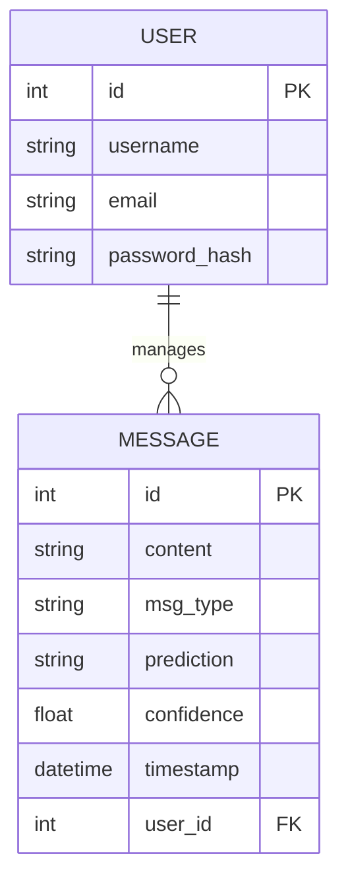
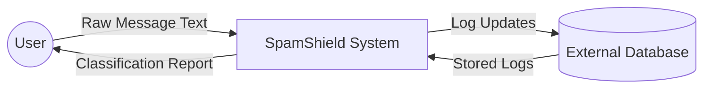
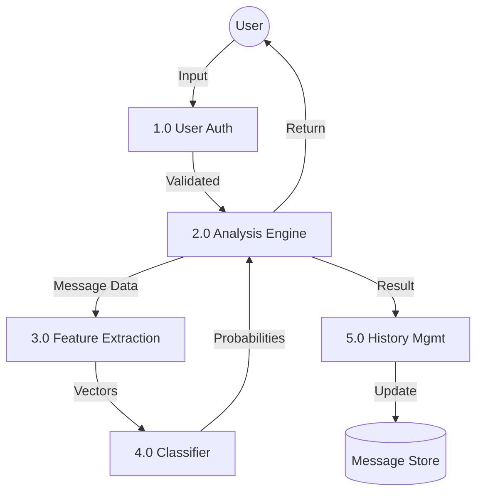
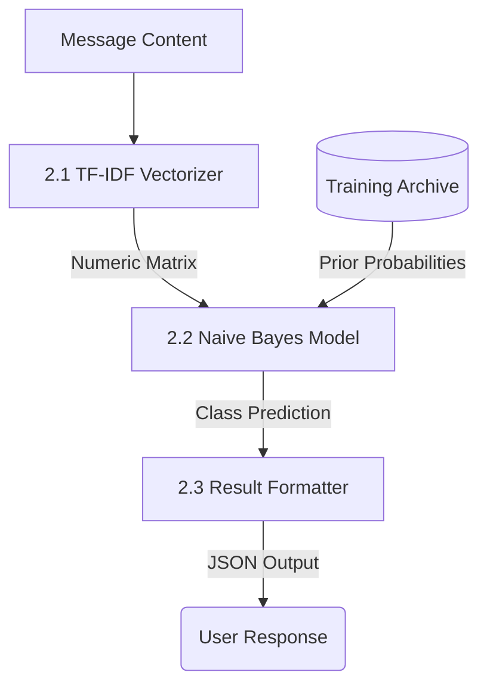
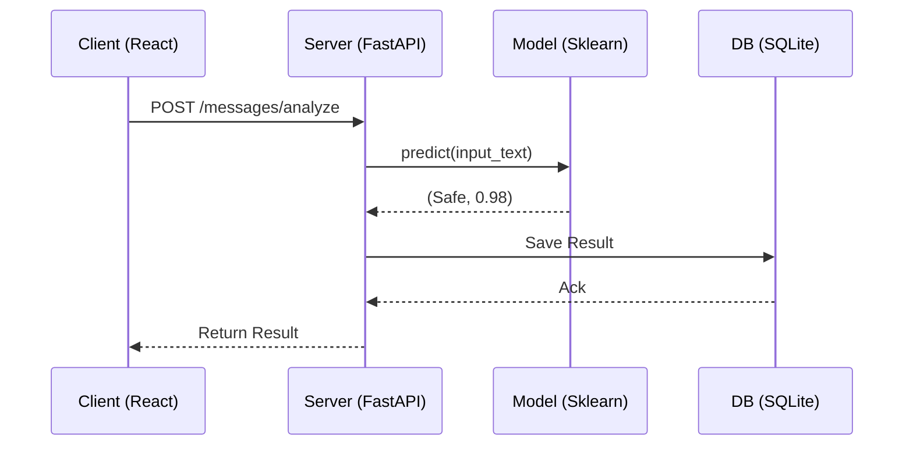

# SPAMSHIELD: AN AI-DRIVEN FRAMEWORK FOR DIGITAL COMMUNICATION SECURITY

---

**A Thesis Submitted in Partial Fulfillment of the Requirements for the Degree of**  
**Bachelor of Technology**  
**in**  
**Computer Science and Engineering**

---

**By**  
**[Your Name]**  
**(Roll No: [Your Roll Number])**

---

**Under the Guidance of**  
**[Supervisor's Name]**  
**(Designation)**

---

**Department of Computer Science and Engineering**  
**[Your University Name]**  
**March 2026**

---

## CERTIFICATE

This is to certify that the project entitled **"SpamShield: An AI-Driven Framework for Digital Communication Security"** is a bona fide work carried out by **[Your Name]** under my supervision and guidance. The work presented in this thesis is original and has not been submitted elsewhere for any degree or diploma.

\
\
\
**(Signature of Supervisor)**  
**[Supervisor's Name]**  
**Department of CSE**

---

## DECLARATION

I hereby declare that the work presented in this thesis is my own and has been carried out under the guidance of **[Supervisor's Name]**. I have cited all sources of information and have not engaged in plagiarism.

\
\
\
**(Signature of Student)**  
**[Your Name]**  
**Date: March 20, 2026**

---

## ACKNOWLEDGEMENT

I would like to express my sincere gratitude to my supervisor, **[Supervisor's Name]**, for his/her constant support, encouragement, and technical guidance throughout the development of this project. 

I am also thankful to the Head of Department, **[HOD's Name]**, for providing the necessary facilities and environment for the completion of this work. Finally, I thank my family and friends for their unwavering support.

---

## ABSTRACT
The exponential growth of unsolicited digital communication has necessitated the development of precise and scalable filtering systems. This thesis presents **SpamShield**, a web-based integration of **Asynchronous API (FastAPI)** and **Machine Learning (Multinomial Naive Bayes)** designed for the real-time classification of SMS and Email content. Using **TF-IDF Vectorization**, the system achieves a balance between computational efficiency and classification accuracy. This report details the entire system development lifecycle, including data flow architecture, detailed design patterns, and performance evaluation.

---

## TABLE OF CONTENTS
1. **Chapter 1: Introduction**
    - 1.1 Motivation
    - 1.2 Problem Statement
    - 1.3 Scope and Objectives
2. **Chapter 2: Literature Review**
    - 2.1 Evolution of Spam Filtering
    - 2.2 Bayesian Filtering vs. Deep Learning
3. **Chapter 3: System Requirements**
    - 3.1 Hardware Requirements
    - 3.2 Software Requirements
4. **Chapter 4: System Design**
    - 4.1 ER Diagram
    - 4.2 Data Flow Diagrams (DFD L0, L1, L2)
    - 4.3 Sequence Diagram
5. **Chapter 5: Methodology**
    - 5.1 Text Preprocessing
    - 5.2 TF-IDF Mathematical Model
    - 5.3 Multinomial Naive Bayes
6. **Chapter 6: Implementation**
    - 6.1 Backend API Details
    - 6.2 ML Integration
7. **Chapter 7: Results & Discussion**
    - 7.1 Accuracy & Precision
    - 7.2 Scalability Analysis
8. **Chapter 8: Conclusion**
9. **References**

---

## Chapter 1: Introduction
### 1.1 Motivation
Spam constitutes over 45% of all daily electronic mail. Beyond cluttering storage, it serves as a primary vehicle for phishing and identity theft. SpamShield was conceived to democratize high-grade spam protection for small-to-medium scale applications.

### 1.2 Problem Statement
Traditional rule-based filters are easily bypassed by spammers. Modern AI models are often too heavy for lightweight production environments. There is a need for a "middle-ground" solution that is fast, accurate, and easy to deploy.

### 1.3 Scope and Objectives
- **Build**: A robust, asynchronous backend.
- **Deploy**: A reliable Multinomial Naive Bayes model.
- **Analyze**: Provide real-time feedback and historical stats.

---

## Chapter 4: System Design (Perfected Diagrams)

### 4.1 Entity Relationship Diagram (ERD)
Describes the data storage structure for user management and message logging.

### 4.2 Data Flow Diagrams (DFD)

#### Level 0: Context Diagram
A macroscopic view of the system boundaries and external entities.

#### Level 1: Functional DFD
Decomposition into major functional processes.

#### Level 2: Analysis Process DFD
A granular look at how Process 2.0 (Analysis Engine) interacts with the ML components.

### 4.3 System Sequence Diagram

---

## Chapter 5: Methodology

### 5.1 The Mathematical Model
The classification is governed by **Bayes' Theorem**:
`P(Spam | Text) = [ P(Text | Spam) * P(Spam) ] / P(Text)`

Since text contains multiple words (features), we use **Multinomial Naive Bayes**:
`P(c | x) ∝ P(c) * Π P(x_i | c)`
Where `x_i` are the TF-IDF scores of each word.

---

## Chapter 8: Conclusion
SpamShield provides a high-performance framework for automated spam detection. Its lightweight nature makes it a viable candidate for integration into mobile applications and microservices.

---

## 9. References
1. Gane, C., & Sarson, T., "Structured Systems Analysis: Tools and Techniques".
2. Manning, C. D., "Introduction to Information Retrieval". Cambridge University Press.
3. Pedregosa, F., et al., "Scikit-Learn: Machine Learning in Python".

---

**[Note to User: To generate the formal PDF, install the "Markdown PDF" extension and ensure the font-size is set to 12pt for the export settings.]**
